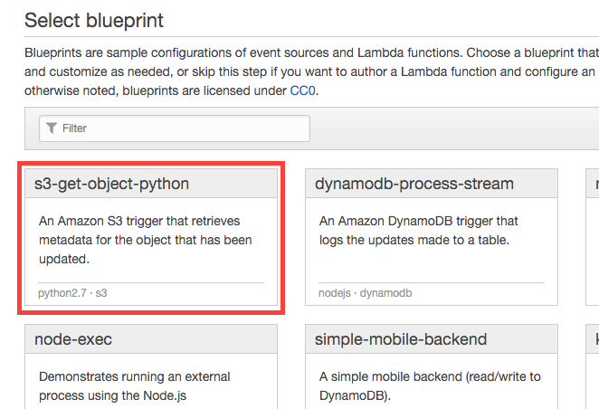

# r7insight_lambdaS3
Follow the instructions below to send logs stored on AWS S3 to Rapid 7.

###### Example use cases:
* Forwarding AWS ELB and CloudFront logs
  * (make sure to set ELB/CloudFront to write logs every 5 minutes)
  * When forwarding these logs, the script will format the log lines according to Rapid 7 KVP or JSON spec to make them easier to analyze
* Forwarding OpenDNS logs

## Obtain log token
1. Log in to your Rapid 7 account

2. Add a new [token based log](https://insightops.help.rapid7.com/docs/token-tcp)

## Deploy the script to AWS Lambda using AWS Console
1. Create a new Lambda function

2. Choose the Python blueprint for S3 objects

   

3. Configure triggers:
   * Choose the bucket log files are being stored in
   * Set event type "Object Created (All)"
   * Tick "Enable Trigger" checkbox

4. Configure function:
   * Give your function a name
   * Set runtime to Python 2.7

5. Upload function code:
   * Create a .ZIP file, containing ```r7insight_lambdas3.py``` and the folder ```certifi```
     * Make sure the files and ```certifi``` folder are in the **root** of the ZIP archive
   * Choose "Upload a .ZIP file" in "Code entry type" dropdown and upload the archive created in previous step

6. Set Environment Variables:
   * Token value should match UUID provided by Rapid 7 UI or API
   * Region should be that of your R7 account

   | Key       | Value      |
   |-----------|------------|
   | region    | eu / us    |
   | token     | token uuid |

7. Lambda function handler and role
   * Change the "Handler" value to ```r7insight_lambdas3.lambda_handler```
   * Assign or create a new role that is allowing GetObject on necessary s3 bucket(s).


8. Advanced settings:
   * Set memory limit to a high enough value to facilitate log parsing and sending - adjust to your needs
   * Set timeout to a high enough value to facilitate log parsing and sending - adjust to your needs
   * Leave VPC value to "No VPC" as the script only needs S3 access
     * If you choose to use VPC, please consult [Amazon Documentation](http://docs.aws.amazon.com/lambda/latest/dg/vpc.html)

9. Enable function:
   * Click "Create function"

## Gotchas
   * The "Test" button execution in AWS Lambda will **ALWAYS** fail as the trigger is not provided by the built in test function. In order to verify, upload a sample file to source bucket


## 3rd party dependencies
   * [python-certifi](https://github.com/certifi/python-certifi)
   

## Contact Support
   * Please email our support team at support@rapid7.com if you need any help.
